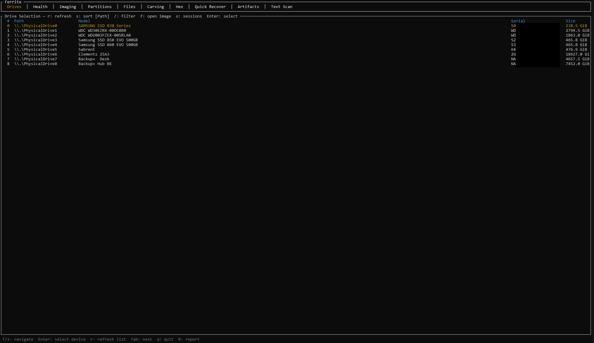
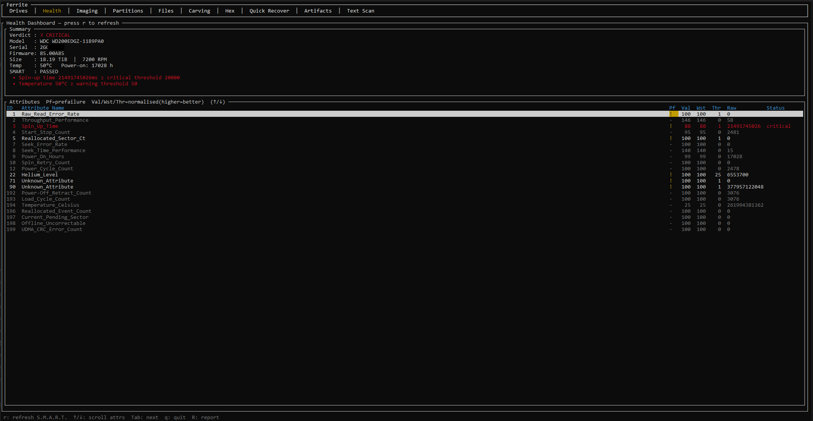
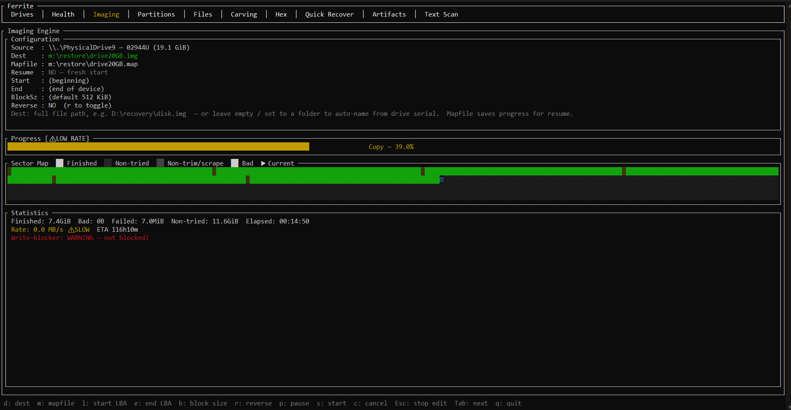
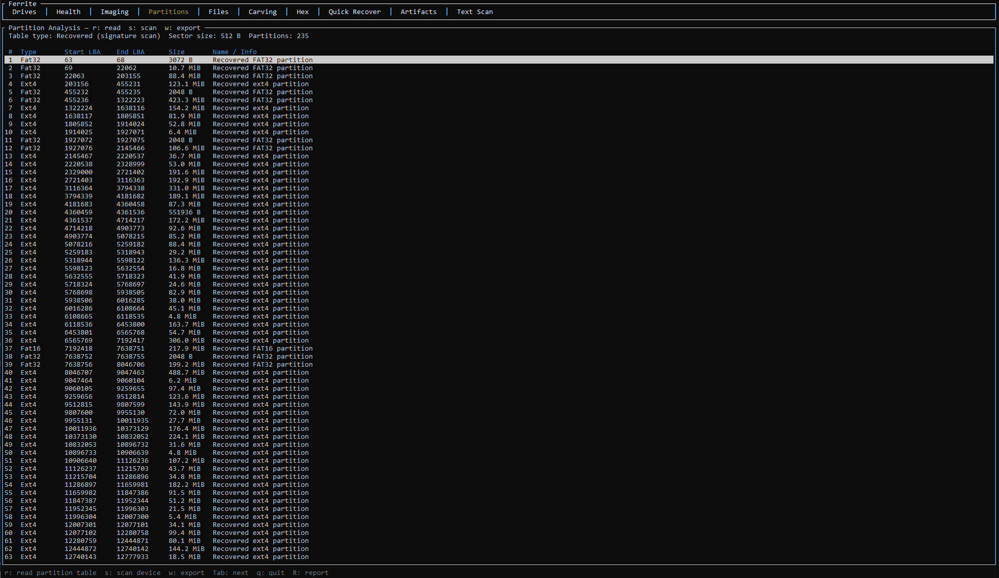
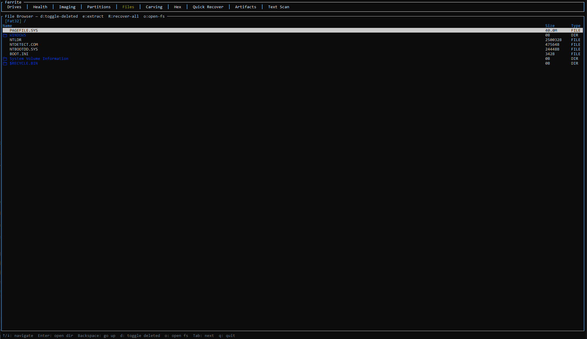
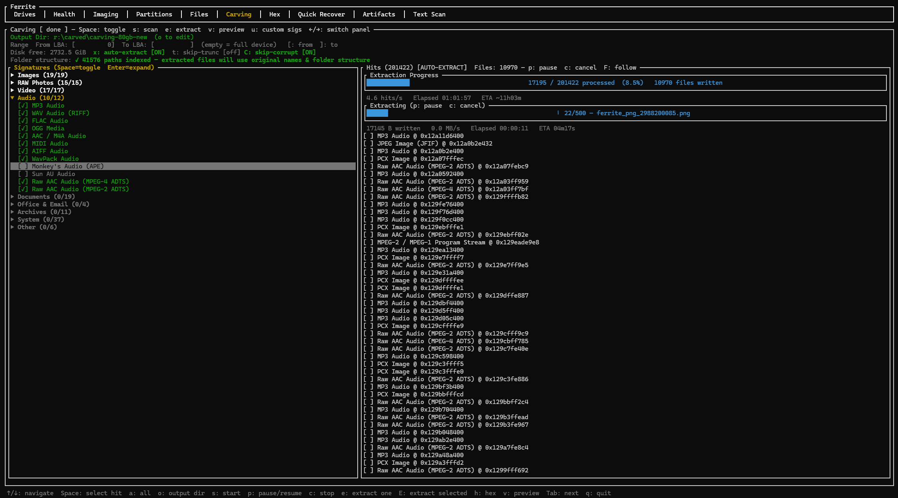
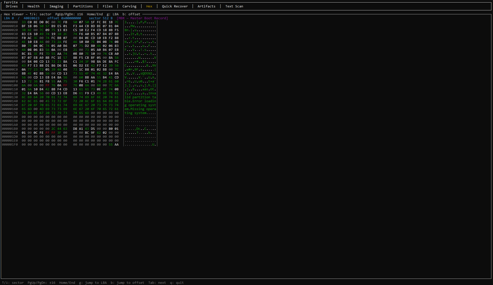
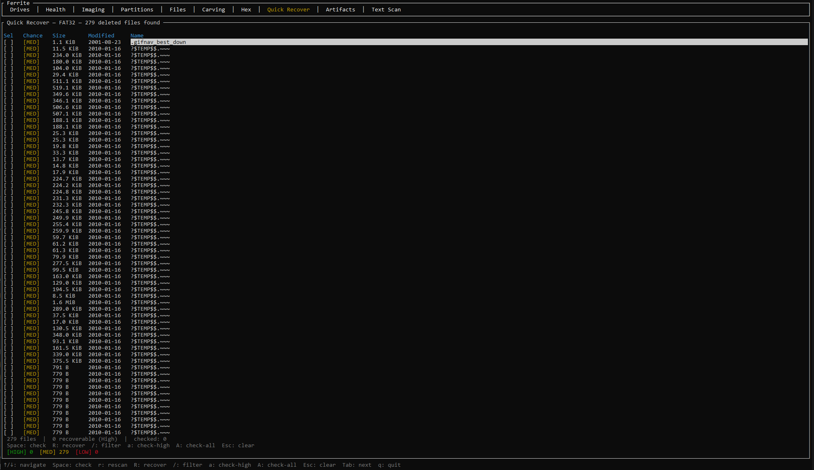
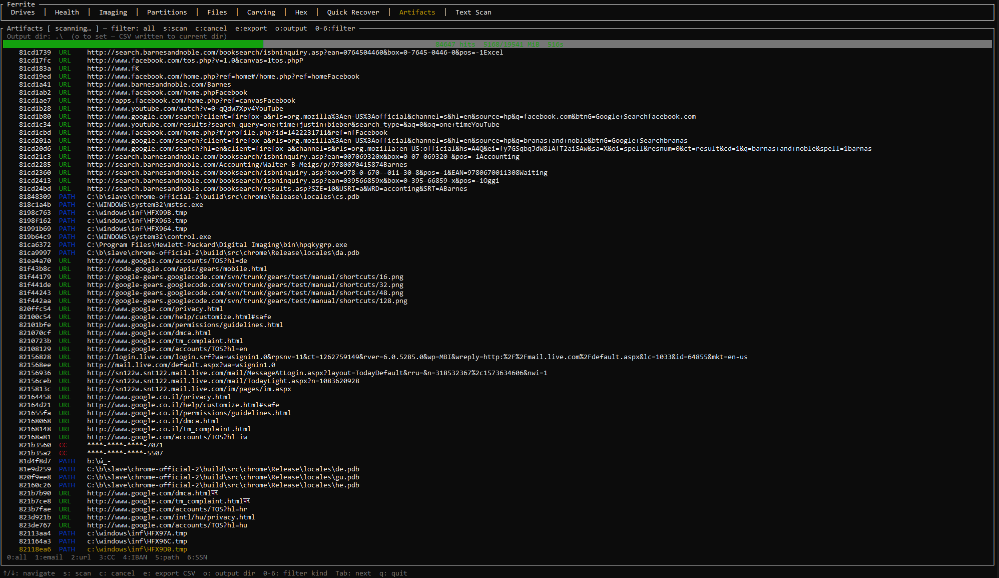
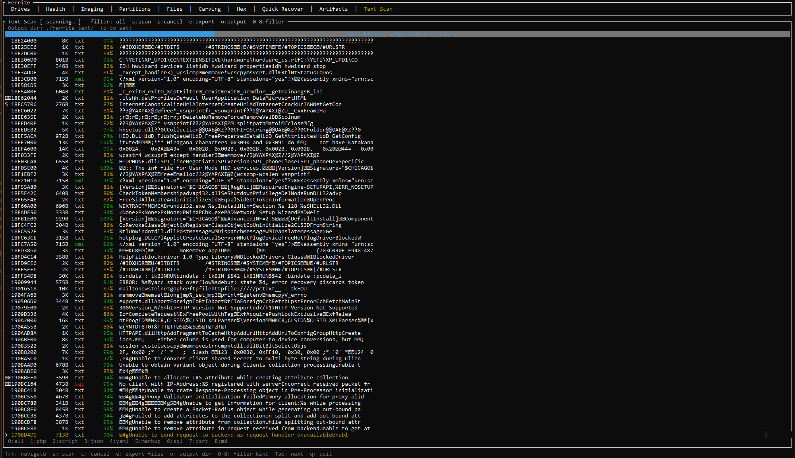

# Ferrite

Autonomous storage diagnostics and data recovery — built in pure Rust.

## Screenshots

### Drive Selection
<!-- Screenshot: Drives tab — device list with serial, model, size columns; image-file open overlay -->


### S.M.A.R.T. Health
<!-- Screenshot: Health tab — attribute table with pass/warn/fail indicators -->


### Resilient Disk Imaging
<!-- Screenshot: Imaging tab — multi-pass progress bar, rate, ETA, pass indicator, stats line -->


### Partition Recovery
<!-- Screenshot: Partitions tab — MBR/GPT table with type, LBA start/end, size -->


### Filesystem Analysis
<!-- Screenshot: Files tab — directory tree with live and deleted (cyan) entries, size and type columns -->


### File Carving
<!-- Screenshot: Carving tab — signature panel (left) + hit list (right) with quality indicators -->


### Hex Viewer
<!-- Screenshot: Hex tab — raw sector view with hex and ASCII columns, offset bar -->


### Quick Recover
<!-- Screenshot: Quick Recover tab — deleted file list with HIGH/MED/LOW recovery-chance tags -->


### Artifact Scanner
<!-- Screenshot: Artifacts tab — hit list with kind (URL/PATH/EMAIL/CC/IBAN/SSN) and offset columns -->


### Text Block Scanner
<!-- Screenshot: Text Scan tab — extracted text block list with kind filter and export options -->


---

## Overview

Ferrite recovers data from failing drives through ten operational screens:

1. **Drive Selection** — Discover block devices or open a disk image file (`f` key) as the active source
2. **S.M.A.R.T. Health** — Health assessment before touching the drive
3. **Resilient Disk Imaging** — ddrescue-style multi-pass imaging with mapfile resume; auto-generates filename from drive serial; watchdog alerts when a read stalls ≥ 90 s
4. **Partition Recovery** — MBR/GPT parsing, corrupt table reconstruction
5. **Filesystem Analysis** — NTFS, FAT32, ext4 — live and deleted file enumeration and extraction
6. **File Carving** — Signature-based recovery from raw sectors (99 signatures, 8 groups)
7. **Hex Viewer** — Raw sector hex viewer with offset navigation
8. **Quick Recover** — Deleted file recovery using filesystem metadata
9. **Artifact Scanner** — Forensic PII scanner (email, URL, credit card, IBAN, SSN, Windows path)
10. **Text Block Scanner** — Heuristic text block extraction with 9 content-kind variants

## Design Principles

- **Pure Rust** — no FFI with C libraries; memory-safe throughout
- **TUI first** — `ratatui` terminal UI, usable in recovery environments without a desktop
- **Platform abstracted** — runs on Windows 11 and Linux via `BlockDevice` trait
- **ddrescue-compatible mapfiles** — interoperable with GNU ddrescue
- **Non-destructive** — read-only access to source drives at all times
- **Damaged-drive resilient** — image-first workflow (`f` key in Drive Selection opens `.img` files); bad sectors zero-filled during extraction rather than aborting; watchdog detects USB/xHCI hangs and advises Reverse mode; volume quiesce stops Windows Search/AutoPlay/Explorer from competing for I/O the moment a drive is selected

## Workspace Crates

| Crate | Responsibility |
|---|---|
| `ferrite-core` | Core types, errors, config; shared **ThermalGuard** (SMART + speed-based inference) |
| `ferrite-blockdev` | Platform-abstracted block device I/O; Windows volume quiesce guard |
| `ferrite-imaging` | Multi-pass imaging engine (SHA-256 sidecar, ThermalGuard, write-blocker) |
| `ferrite-smart` | S.M.A.R.T. diagnostics via smartctl |
| `ferrite-partition` | MBR/GPT parsing and recovery |
| `ferrite-filesystem` | NTFS / FAT32 / ext4 metadata parsing (full extent tree support) |
| `ferrite-carver` | Signature-based file carving (99 signatures, CarveQuality validation, error-tolerant extraction) |
| `ferrite-textcarver` | Heuristic text block scanner (9 TextKind variants) |
| `ferrite-artifact` | Forensic PII artifact scanner (6 scanner types, CSV export) |
| `ferrite-tui` | ratatui terminal interface (10 tabs) |

Binary: `ferrite`

## Prerequisites

- Rust stable (1.75+): [rustup.rs](https://rustup.rs)
- `smartctl` from [smartmontools](https://www.smartmontools.org/) (for S.M.A.R.T. features)
- Windows: run as Administrator for raw device access
- Linux: run as root or with `CAP_SYS_RAWIO` for raw device access

## Build

```bash
cargo build --release
```

## Run

```bash
cargo run --release
```

## Test

```bash
cargo test --workspace
cargo clippy --workspace -- -D warnings
cargo fmt --check
```

## License

Licensed under either of [MIT](LICENSE-MIT) or [Apache-2.0](LICENSE-APACHE) at your option.
